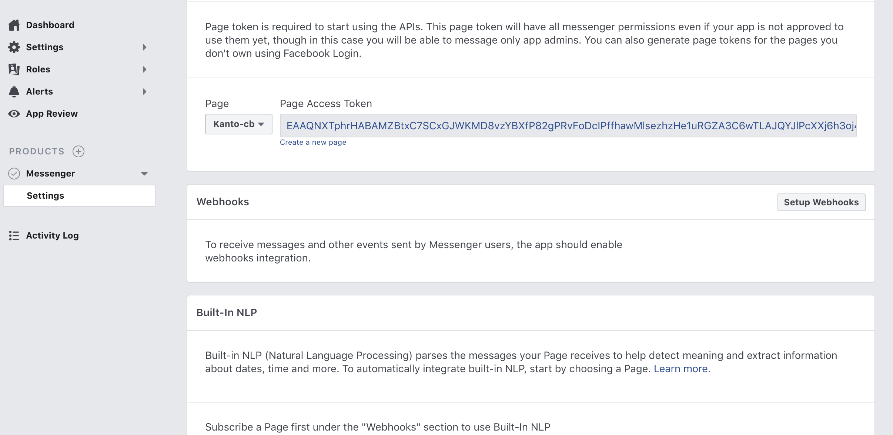
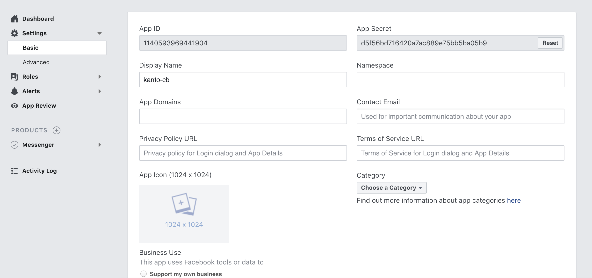
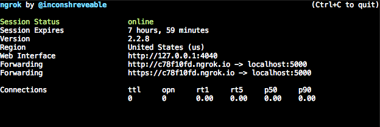
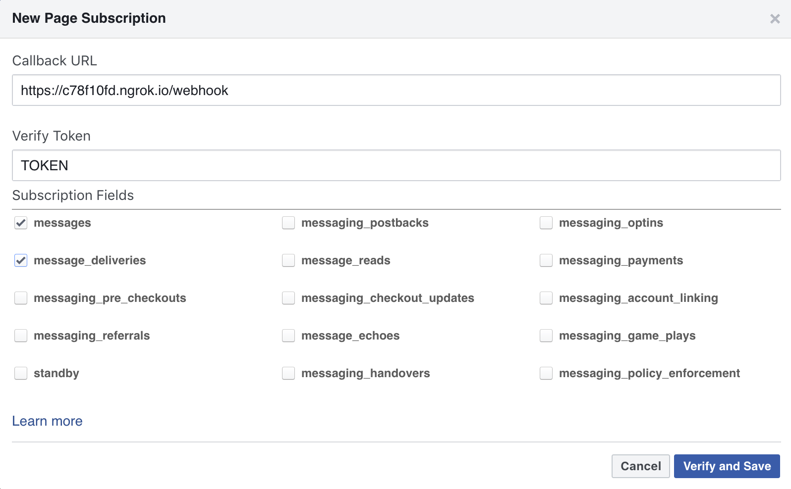

# Kanto train info chatbot
Simple chatbot for grabbing Kanto train information using facebook messenger platform.

## Setup
### Node.js
```shell
curl -sL https://deb.nodesource.com/setup_8.x | sudo -E bash -
sudo apt-get install -y nodejs
sudo apt-get install -y build-essential
```
### Mongodb
```shell
sudo apt-key adv --keyserver hkp://keyserver.ubuntu.com:80 --recv 2930ADAE8CAF5059EE73BB4B58712A2291FA4AD5
echo "deb [ arch=amd64,arm64 ] https://repo.mongodb.org/apt/ubuntu xenial/mongodb-org/3.6 multiverse" | sudo tee /etc/apt/sources.list.d/mongodb-org-3.6.list
sudo apt-get update
sudo apt-get install -y mongodb-org
```
### Facebook messenger Platform
- Create a [facebook page](https://www.facebook.com/pages/creation/)
- Create a [facebook application](https://developers.facebook.com/apps/)
- Add Messenger product to the application
- Generate a page access token for the application



### Project setup
- Clone this project

```shell
git clone https://github.com/qmau-me/kanto-rosen.git
```
- Set the `appSecret` and `pageAccessToken` in `config/default.json` with page access token and app secret from application admin dashboard.



- Set a `validationToken` for webhook validation.
- Replace values for `APP_ID` and `PAGE_ID` in `public/index.html`.

## Run
- Run the project
```shell
npm install
node app.js
```
- Start MongoDB
```shell
sudo service start mongod
```
- [Follow those steps](https://ngrok.com/download) to use ngrok setting up an reachable endpoint for the Facebook messenger.
- Config webhook endpoint with https link from the ngrok terminal
```
ngrok http 5000
```


- Subscribed to created page
- Enjoy the chatbot on messenger page
<iframe src='https://gfycat.com/ifr/SmartOrdinaryBluebreastedkookaburra' frameborder='0' scrolling='no' allowfullscreen width='640' height='893'></iframe><p> <a href="https://gfycat.com/gifs/detail/SmartOrdinaryBluebreastedkookaburra">via Gfycat</a></p>

## Command list
- help: show all chatbot options
    - list: list all subscribed line
    - unsub: chose to delete a line from the subscribed line list

## License

See the LICENSE file in the root directory of this source tree. Feel free to use and modify the code.
